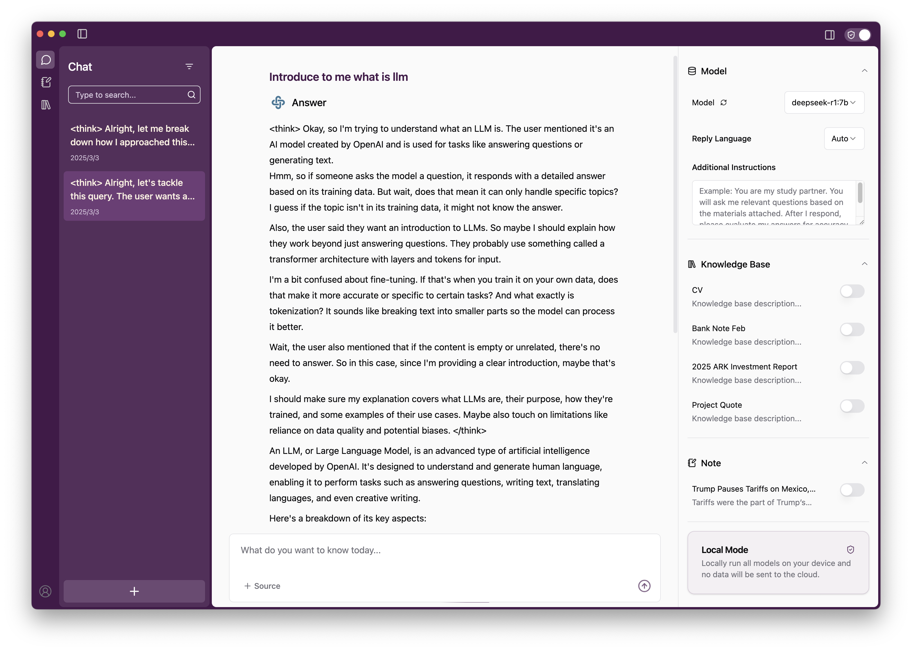

# klee-service

Klee is a fully open-source platform that brings secure, local AI to your desktop.

For more information, visit our <u>[Website](https://kleedesktop.com/)</u>.



At its core, Klee is built on:
- <u>[Ollama](https://ollama.com/)</u>: For running local LLMs quickly and efficiently.
- <u>[LlamaIndex](https://www.llamaindex.ai/)</u>: As the data framework.

With Klee, you can:
- Download and run open-source large language models on your desktop with a single click - no terminal or technical background required.
- Utilize the built-in knowledge base to store your local and private files with complete data security.
- Save all LLM responses to your knowledge base using the built-in markdown notes feature.

## 🔧 Installation


### 1. System Requirements
- Windows 7+ or higher
- MacOS 15.0+ or higher
- Python 3.12.4+
- pip 23.2.1+

### 2. You should finish the steps from <u>[Klee Client](https://github.com/signerlabs/klee-client)</u> and then start here.

### 3. Clone the repository

```bash
git clone https://github.com/signerlabs/klee-service.git
cd klee-service
```

### 4. Install the dependencies

- Windows

    After entering the root directory of the project, use Win + R to open the Run dialog, type cmd, and press Enter.

    Type the following command to create a virtual environment:

    ```bash
    python -m venv venv
    ```

    Source the virtual environment:
    ```bash
    venv\Scripts\activate
    ```

    Use the following command to install the package:
    ```bash
    pip install -r requirements.txt
    ```

- MasOS/Linux

    After entering the root directory of the project, use the following command to create a virtual environment:

    ```bash
    python3 -m venv venv
    ```

    Source the virtual environment:
    ```bash
    source venv/bin/activate
    ```

    Use the following command to install the package:
    ```bash
    pip install -r requirements.txt
    ```

### 5. Change source code
- Window: 'venv/Lib/site-packages/llama_index/llms/ollama/base.py' is missing some code.

- MacOS: 'venv/lib/python3.12/site-packages/llama_index/llms/ollama/base.py'

Find method 'def _get_response_token_counts(self, raw_response: dict)' and change with the following code:
```python
    def _get_response_token_counts(self, raw_response: dict) -> dict:
        """Get the token usage reported by the response."""
        if raw_response["done"] == False:
            return {
                "prompt_tokens": 0,
                "completion_tokens": 0,
                "total_tokens": 0,
            }
        # The above code is the code that needs to be added
        try:
            prompt_tokens = raw_response["prompt_eval_count"]
            completion_tokens = raw_response["eval_count"]
            total_tokens = prompt_tokens + completion_tokens
        except KeyError:
            return {}
        return {
            "prompt_tokens": prompt_tokens,
            "completion_tokens": completion_tokens,
            "total_tokens": total_tokens,
        }
```

### 6. Start the service

Use the following command to start the service:
```bash
python main.py
```

The default environment is local, if you want to run the server in the background, you can use the following command:
```bash
python main.py --env your_env_name
```

The default port number is 6190, if you want to change the port number, you can use the following command:
```bash
python main.py --port 6191
```

### 7. Go back to <u>[Klee Client](https://github.com/signerlabs/klee-client)</u> and finish the rest of the initialization process.

## ☁️ Cloud Configuration - Not released yet

If you want to use the OpenAI API or Llama Cloud API, you need to provide your API key.
Create a .env file in the root directory of the project and add the following content:

```env
OPENAI_KEY="your_openai_key"
LLAMA_CLOUD_API_KEY="your_llama_cloud_api_key"
```

## 🏠 Build - Optional
### Windows
Use the following command to build the project:
```bash
pyinstaller --uac-admin --icon=klee-main.ico  --additional-hooks-dir=./hooks --add-data "./venv/Lib/site-packages/llama_index/core/agent/react/templates/system_header_template.md;./llama_index/core/agent/react/templates" --hidden-import=pydantic.deprecated.decorator --hidden-import=tiktoken_ext.openai_public --hidden-import=tiktoken_ext  -D main.py --clean
```

### MacOs/Linux
Use the following command to build the project:
```bash
pyinstaller --uac-admin --icon=klee-main.ico  --additional-hooks-dir=./hooks --add-data "./venv/lib/python3.12/site-packages/llama_index/core/agent/react/templates/system_header_template.md:./llama_index/core/agent/react/templates" --hidden-import=pydantic.deprecated.decorator --hidden-import=tiktoken_ext.openai_public --hidden-import=tiktoken_ext  -D main.py --clean
```

## 📖 Technology Stack

- <u>[Python](https://kleedesktop.com/)</u>
- <u>[LlamaIndex](https://www.llamaindex.ai/)</u>
- <u>[Ollama](https://ollama.com/)</u>
- <u>[Sqlalchemy](https://www.sqlalchemy.org/)</u>
- <u>[FastAPI](https://fastapi.tiangolo.com/)</u>

